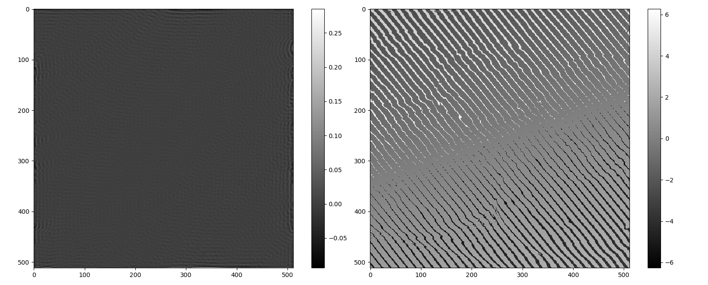

## Oblique illumination results using phase factor versus spectral shift

code source:  
D:\Workspace\project\Imaging_Forward_Propagate\Propagate.py 

    """ python  
    class ValSpectrum:  
    
        def __init__(self, **kwargs):
            self.p = {"amp_img": "a.jpg", "pha_img": "b.jpg",
                      "pixel_size": 6.328e-6, "wavelength": 632.8e-9,
                      "pixel_num": 512, "magnification": 20, "obj_na": 0.4}
            for key in self.p:
                if key in kwargs:
                    self.p[key] = kwargs[key]  
            self.k = 2 * np.pi / self.p["wavelength"]  
            amp_img = resize(io.imread(self.p["amp_img"]),  
                             (self.p["pixel_num"], self.p["pixel_num"]))  
            pha_img = resize(io.imread(self.p["amp_img"]),  
                             (self.p["pixel_num"], self.p["pixel_num"]))  
            self.amp_img = (amp_img - amp_img.min()) / (amp_img - amp_img.min()).max()  
            self.pha_img = np.pi * (pha_img - pha_img.min()) / (pha_img - pha_img.min()).max()  
            self.wf_init = self.amp_img * np.exp(1j * self.pha_img)  
            self.x_mat, self.y_mat = self._spatial_coord()  
            self.delta_k, (self.kx_mat, self.ky_mat) = self._frequency_coord()  
            self._ctf = (self.kx_mat**2 + self.ky_mat**2) < (self.p["obj_na"]*self.k)**2  
            
        def _spatial_coord(self):  
            self.dx = self.p["pixel_size"] / self.p["magnification"]  
            self.dy = self.p["pixel_size"] / self.p["magnification"]  
            x = np.linspace(-self.p["pixel_num"]*self.dx/2, self.p["pixel_num"]*self.dx/2, self.p["pixel_num"])  
            y = -np.linspace(-self.p["pixel_num"]*self.dy/2, self.p["pixel_num"]*self.dy/2, self.p["pixel_num"])  
            return np.meshgrid(x, y)  
            
        def _frequency_coord(self):  
            # return delta_k, (kx_mat, ky_mat)  
            kx = 2*np.pi*np.linspace(-1/self.dx/2, 1/self.dx/2, self.p["pixel_num"])  
            ky = 2*np.pi*np.linspace(-1/self.dx/2, 1/self.dx/2, self.p["pixel_num"])  
            return 2*np.pi/self.dx/self.p["pixel_num"], np.meshgrid(kx, ky)  
            
        def tilt_illu_formation(self, x_na, y_na):  
            # algorithm is performs  bright field microscopy when (x_na**2 + y_na**2) < obj_na**2  
            kx_na, ky_na = self.k * x_na, self.k * y_na  
            factor_tilt = np.exp(1j*(self.x_mat*kx_na + self.y_mat*ky_na))  
            self.ft_init = ft2(factor_tilt * self.wf_init)  
            self.ft_init[~self._ctf] = 0+0j  
            return ift2(self.ft_init)  
            
        def spectrum_offset_formation(self, x_na, y_na):  
            kx_na, ky_na = self.k * x_na, self.k * y_na  
            kx_offset = kx_na / self.delta_k  
            ky_offset = ky_na / self.delta_k  
            self.ft_init = ft2(self.wf_init)  
            self.ft_shifted = np.zeros((512, 512)).astype(np.complex)  
            kxc = self.ft_init.shape[-1] // 2 - kx_offset  
            kyc = self.ft_init.shape[-2] // 2 + ky_offset  
            core_w = int(self.k * 0.45 // self.delta_k)  
            spectrum_core = self.ft_init[int(kyc-core_w):int(kyc+core_w), int(kxc-core_w):int(kxc+core_w)]  
            self.ft_shifted[int(256-core_w):int(256+core_w), int(256-core_w):int(256+core_w)] = spectrum_core  
            self.ft_shifted[~self._ctf] = 0+0j  
            return ift2(self.ft_shifted)   
            
    def main():
    val_spec = ValSpectrum()
    ft_tilt = val_spec.tilt_illu_formation(0.12, 0.1)
    ft_sifted = val_spec.spectrum_offset_formation(0.12, 0.1)
    plt.figure(figsize=[12, 5])
    plt.subplot(121)
    plt.imshow((abs(ft_sifted)-abs(ft_tilt)), cmap="gray")
    plt.colorbar()
    plt.subplot(122)
    plt.imshow((np.angle(ft_sifted)-np.angle(ft_tilt)), cmap="gray")
    plt.colorbar()
    plt.show()
    """   
results:
  

As shown in the phase image, there is a certain deviation in the tilt angle of the illumination light of the two images