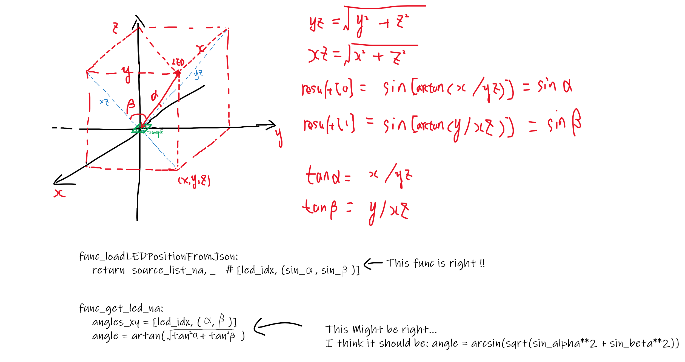

# Code inspection

I think I found some mistake at:  
"D:\Workspace\files\DeepAF-master\util\afutil.py"  
func get_led_na:  

    """
    def get_led_na(led_index):
        source_list_na, source_list_cart = loadLedPositonsFromJson('quasi_dome_design.json')
        angles_xy = np.arcsin(np.abs(source_list_na))
        angle = np.arctan(np.sqrt(np.tan(angles_xy[:, 0])**2 + np.tan(angles_xy[:, 1])**2))
        return np.sin(angle[led_index - 1])
    """  

according to this graph:  

the angle should be:  

    """
    angle = np.arcsin(np.sqrt(np.sin(angles_xy[:, 0])**2 + np.sin(angles_xy[:, 1])**2))
    """